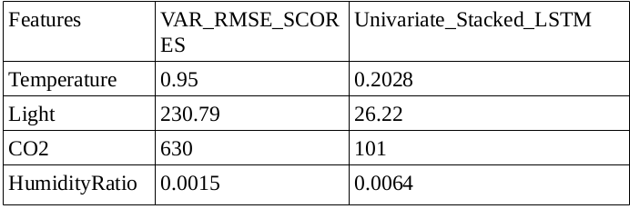
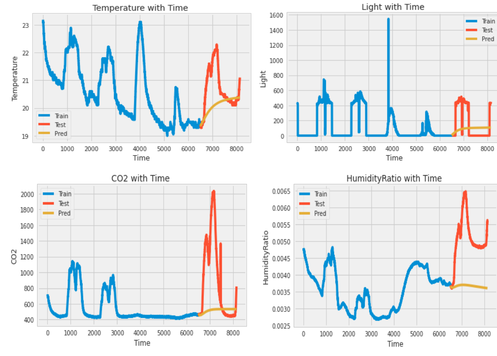
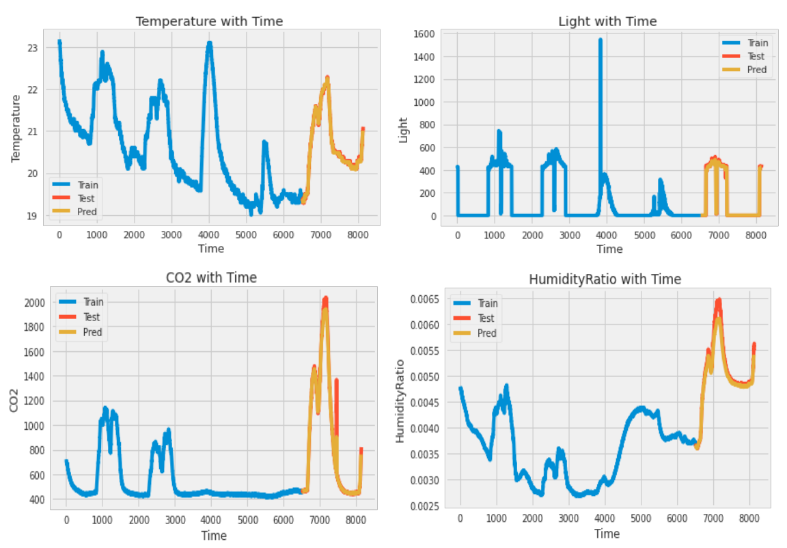

# Room_Occupancy_Detection
This dataset describes climatic features of a room and the objective is to predict whether or not the room is occupied.
There are 20,560 one-minute observations taken over the period of a few weeks,over which the model is to be trained and classified.This is a classification prediction problem on which 2 methods have been fit and compared-

1.Vector AutoRegression(Statistical Modelling)

2.Univariate Stacked LSTM(Deep Learning)

# Similar Use Cases

    1.Stock Market Analysis
    
    2.Economic Forecasting
   
    3.Inventory studies
    
    4.Budgetary Analysis 
    
    5.Census Analysis 
    
    6.Yield Projection 
    
    7.Sales Forecasting 
    
    etc.

## Workflow

1.) Create a classification model.(included in Classification_Engine)

2.) Create TimeSeries Forecasting Models(included STM_Pred and VAR)

3.) Model Tuning

4.) Classifying the Forecasted Data and keep improving.

5.) Forecast Future room occupancy requirement.(in progress)

6.) Fitting better models.(in progress)

## Classification Model-

  Model-RandomForestClassifier(decision trees=100,Bootstrap=True)
  
  Model_Accuracy-0.9914(train:test=80:20)
  
  Model Fit After Balancing the data using SMOTE
  
## TimeSeries Forecasting
#### Vector AutoRegression(VAR)
   A VAR model was trained and tuned on the 80:20 split with a max. lag of 28 observations(aic=28).
   
   Observation-Though the computation is pretty inexpensive.The model does not genralise too well,resulting in poor classification accuracy and a less relaible model
   
#### Univariate Stacked LSTM
  Individual Features were trained with a max. lag of 10 observations and stacked together for as final_forecast
  
  Model_Summary-4 LSTM Layers
  
                 1 Dense Layer
                           
                 optimizer=adam
  
  Observation-The model albeit computationally expensive,genralises pretty well and gives an almost 98% accuracy on classification wrt to test split.
  
  
  ## Model Comparision
  
  
  
  ## Visual_Comparision
  
  VAR_Model
  
  
  
  The model seems to follow a long term sequence and does not generalise too well.
  
  LSTM Model
  
  
  
  The model seems to generalise very well giving us almost accurate results,upon which future can easily be forecasted and room avalablity can be understood well in advance.
  
  Data Profiling_VAR-
  
 ## Performance(Considering Only LSTM Model)
 
 Classification accuracy on Forecasted Dataset wrt to Test Dataset-:
 
 1.The No. of correct classication of occupancy by the model is 583 of 588
 
 2.The No. of correct classication of inoccupancy by the model is 1035 of 1041 
 
 ## Conclusion
 
 The LSTM model albeit computationally expensive beats the statistical model hands down on a such a complex TimeSeries.
 However,the simplicity and accuracy measure of statistical models on datasets composed of simpler trends and a defined     seasonablity cannot be ignored.

## Acknowledgements-

1. UCI Machine Learning Repository

2. Analytics India

3. Krish Naik
